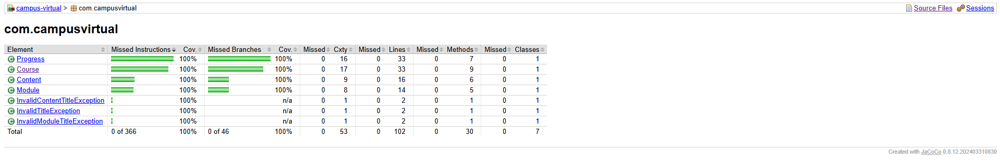

### Campus Virtual - Core Domain

Campus Virtual is an e-learning platform. This repository contains the Pure Domain Core (Core de Entidades de Dominio Puro), completely isolated from any frameworks, databases, or external interfaces, following the principles of Clean Architecture / Hexagonal Architecture.

### Architecture Highlights

* **Pure Java:** No Spring, JPA, or web annotations. The domain depends only on itself.
* **Dependency Inversion:** All external interactions (such as notifications) are modeled as interfaces (`NotificationService`) and injected via constructors.
* **English Nomenclature:** Clean, modular code entirely in English.
* **Architecture Specifications:** Refer to the [Domain Architecture & Design](docs/domain-architecture.md) documentation for a detailed overview of class diagrams, business invariants, and domain rules.

### Project Structure

```text
campus-virtual/
├── docs/
│   └── domain-architecture.md            # Domain model specifications
├── pom.xml                               # Project dependencies (Java 25, JUnit 5, Mockito, JaCoCo)
└── src/
    ├── main/
    │   └── java/
    │       └── com/
    │           └── campusvirtual/
    │               ├── Content.java      # Atomic learning unit (Lesson)
    │               ├── Course.java       # Root Aggregate
    │               ├── Module.java       # Container of Contents
    │               ├── Progress.java     # Tracks completed contents and progress %
    │               └── NotificationService.java # Outbound notification port
    └── test/
        └── java/
            └── com/
                └── campusvirtual/
                    ├── ContentTest.java  # Tests for Content domain logic
                    ├── CourseTest.java   # Tests for Course lifecycle
                    ├── ModuleTest.java   # Tests for Module boundaries
                    └── ProgressTest.java # Tests for sequential learning flow
```

### Code Coverage Evidence



### Testing & Quality Assurance

This project uses JUnit 5 and Mockito to ensure the highest standards of quality:

* **Rigorous AAA Pattern:** All tests are strictly structured using Arrange, Act, and Assert phases.
* **Business Exceptions:** Custom domain exceptions (`InvalidTitleException`, `InvalidContentTitleException`, `InvalidModuleTitleException`) are verified thoroughly using `assertThrows`.
* **100% Coverage:** The test suite guarantees 100% Line and Branch coverage, ensuring no orphan logic exists across all domain entities (`Course`, `Module`, `Content`, `Progress`).

### How to Verify

To run the automated tests and generate the JaCoCo coverage report, execute the following command in the root of the project:

```bash
mvn clean test jacoco:report
```

### Coverage Evidence Route

After running the command above, you can find and open the detailed HTML coverage report at:
* `target/site/jacoco/index.html`
