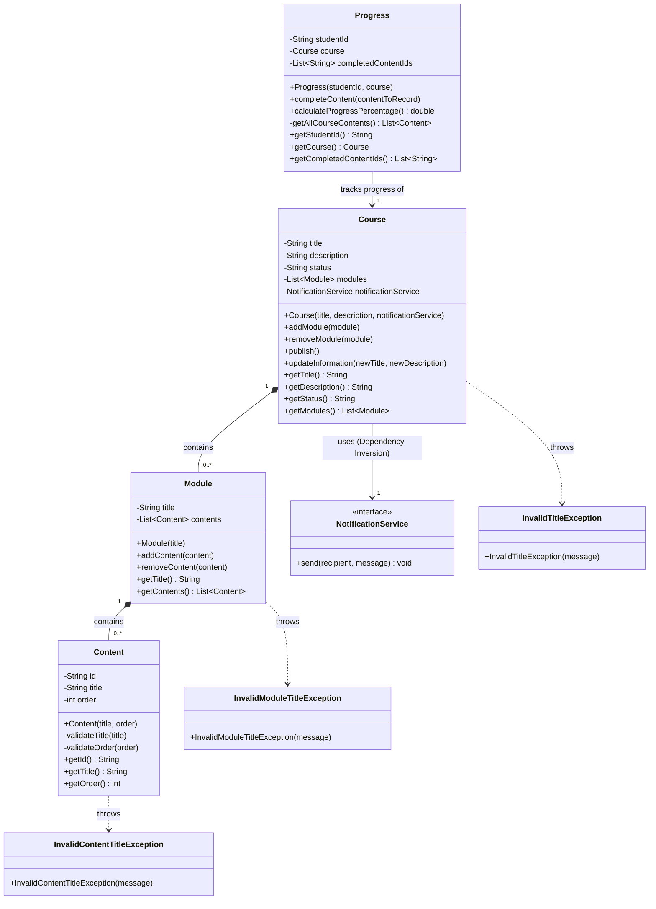

### Domain Architecture & Design: Campus Virtual

This document outlines the architectural specifications, core domain design, ubiquitous language, business invariant matrix, and testing strategies implemented in the **Campus Virtual** pure domain core.

### 1. Domain Overview & Ubiquitous Language

Following the principles of **Domain-Driven Design (DDD)** and **Clean Architecture**, the core logic is isolated from database persistence frameworks (e.g., JPA/Hibernate) and framework environments (e.g., Spring Boot). The ubiquitous language represents the shared vocabulary of business concepts within the Campus Virtual context:

*   **Course:** The root aggregate representing an educational syllabus. A course maintains a list of modules, can be updated, and transitions through lifecycle states (e.g., `DRAFT` or `PUBLISHED`).
*   **Module:** A structural container representing a specific topic or division within a `Course`. It groups sequential educational contents.
*   **Content:** An atomic learning unit (e.g., a video lesson, document, or assignment) inside a `Module`. Each content has a specific sequence order (`order`) relative to the course.
*   **Progress:** An entity tracking a student's navigation through a specific `Course`. It enforces the core educational flow constraints by ensuring linear learning.
*   **NotificationService:** An outbound port (interface) used to send alerts to the external ecosystem (e.g., notifying admins about new courses). The domain core dictates the contract, and concrete infrastructure adapters implement it.

### 2. Domain & Class Diagram

The class diagram below illustrates the structural relationships, invariants, and dependency inversion pattern used to isolate the core domain from infrastructural operations.

### 3. Business Rules & Invariants Matrix

| Entity | Action | Rule / Invariant | Constraint & Exception |
| :--- | :--- | :--- | :--- |
| **Course** | Creation | A course must have a non-empty, non-null title. | Throws `InvalidTitleException` |
| **Course** | Creation | Creating a course must trigger a notification message. | Sends notification via `NotificationService` |
| **Course** | Modify Info | Updating information is only allowed when status is `DRAFT`. | Throws `IllegalStateException` |
| **Course** | Modify Info | The updated title cannot be null, empty, or blank. | Throws `InvalidTitleException` |
| **Course** | Add Module | A course cannot exceed a maximum limit of 30 modules. | Throws `IllegalStateException` |
| **Course** | Remove Module | A module cannot be removed if the course is already `PUBLISHED`. | Throws `IllegalStateException` |
| **Course** | Publish | A course cannot transition to `PUBLISHED` if it has zero modules. | Throws `IllegalStateException` |
| **Module** | Creation | A module must have a non-empty, non-null title. | Throws `InvalidModuleTitleException` |
| **Module** | Add Content | Adding content cannot accept null references. | Throws `IllegalArgumentException` |
| **Content** | Creation | The title cannot be null, empty, or whitespace. | Throws `InvalidContentTitleException` |
| **Content** | Creation | The sequential order of the content must be $\ge 1$. | Throws `IllegalArgumentException` |
| **Progress** | Creation | Student ID cannot be null, empty, or whitespace. Course cannot be null. | Throws `IllegalArgumentException` |
| **Progress** | Complete Content | **Sequential Constraint:** Cannot complete content if there is any content with a lower `order` number that remains uncompleted. | Throws `IllegalStateException` |
| **Progress** | Complete Content | Completing already completed content is safely ignored without duplicate entries or errors. | Idempotent operation (No-Op) |
| **Progress** | Calculate Advance | The percentage progress is calculated as: $\frac{\text{completed}}{\text{total}} \times 100.0$. Returns `0.0` if the course has no content. | Prevents division by zero safely |

### 4. Testing & Quality Strategy

To satisfy the high-quality requirements of Hito 1, the test suite is engineered around absolute isolation and thorough validation:

#### 4.1 Unit Testing Framework (JUnit 5)
*   Tests are structured using the formal **AAA (Arrange-Act-Assert)** pattern.
*   Boundary conditions (empty strings, single character spaces, null arguments) are covered using JUnit 5 `@ParameterizedTest` and `@ValueSource`.
*   Descriptive `@DisplayName` annotations are written on every test in English to document the business capability under review.

#### 4.2 Dependency Mocking (Mockito)
*   Outbound ports like `NotificationService` are mock-injected dynamically via Mockito's `@Mock` and `@BeforeEach` initialization.
*   Interaction tests use `verify(mock, times(1))` to ensure side effects are fired properly.
*   Java 25 dynamic attachment limits are bypassed safely in the test configuration using the JVM VM option `-Dnet.bytebuddy.experimental=true` in Surefire, enabling seamless inline mocking.

#### 4.3 Code Coverage (JaCoCo)
*   **100% Line and Branch Coverage** is enforced and validated programmatically using the `jacoco-maven-plugin`.
*   Unused boilerplate classes have been removed to keep the coverage metrics focused strictly on the domain entities (`Course`, `Module`, `Content`, `Progress`).